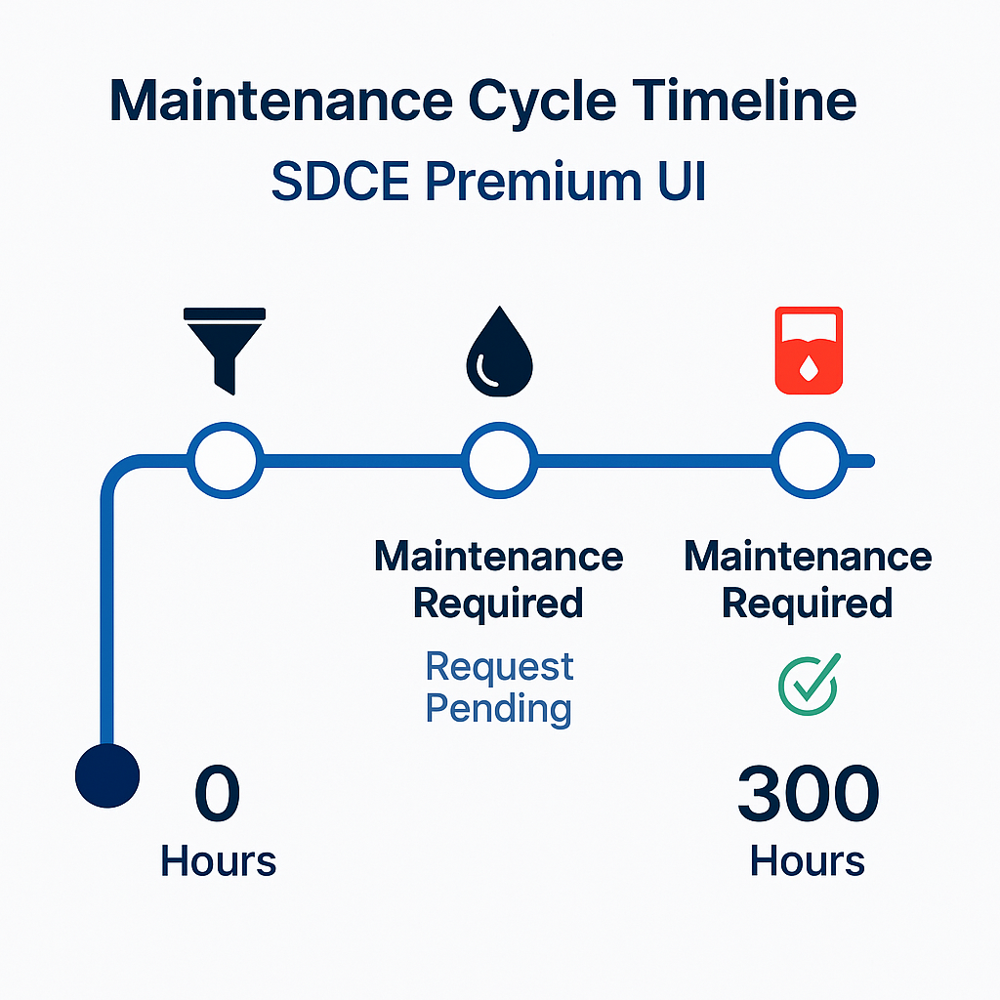

<div align="center">


<h1>🚀 SDC Fleet Management System</h1>

<h3>Professional Fleet, Fuel & Maintenance Management Module for ERPNext V15</h3>

<p>
  
  
  
  
</p>

</div>


---

## 📌 Overview (نبذة مختصرة)

**SDC Fleet Management** هو نظام متكامل لإدارة:

- 🚛 **معدات المؤسسة**
- 🛠️ **الصيانة الدورية والطارئة**
- ⛽ **تعبئة الديزل وتحليل الاستهلاك**
- 👷 **السائقين**
- 📊 **لوحات تحكم احترافية (Standard + PRO Dashboard)**

تم تصميم النظام خصيصًا لمؤسسة **شمس دبي للمقاولات** ليعمل داخل ERPNext V15 بشكل كامل دون أي تعديل على النظام الأساسي.

---

## 🔥 Key Features — أهم المميزات

### 🔧 الصيانة
- إنشاء طلب صيانة **Maintenance Request**
- سجل صيانة متكامل **Maintenance Log**
- إدارة دورات الصيانة **Maintenance Cycle**
- تنبيهات حسب عدد الساعات (250 / 300 / إلخ)

### ⛽ إدارة الوقود
- سجلات تعبئة fuel log  
- حساب **استهلاك الوقود (لتر/ساعة)** تلقائيًا  
- تحليل بيانات الوقود في Dashboard متقدم

### 🚚 إدارة المعدات
- ملف تعريفي لكل معدّة + صور  
- سجل حركة المعدات  
- متابعة ساعات التشغيل

### 📊 لوحات تحكم (Dashboard)
**Standard Dashboard + Dashboard PRO (مخصص للشركة)**

مع رسوم بيانية جاهزة:

- Fuel Analytics  
- KPIs  
- Maintenance cycle  
- Utilization chart  
- Equipment profile  

---

## 🖼️ Screenshots (صور من النظام)

<div align="center">

### 🔹 **Fueling Analytics Dashboard**


---

### 🔹 **Equipment Profile**


---

### 🔹 **Maintenance Cycle Timeline**


---

### 🔹 **Fleet Dashboard PRO**


</div>

---

## 🏗️ Installation (تثبيت التطبيق)

### 1️⃣ داخل مجلد الـ bench  
```bash
cd ~/frappe-bench
